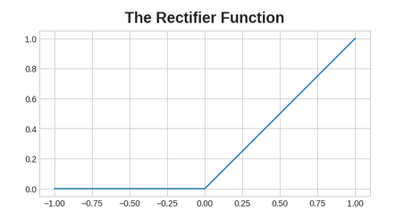

# Intro to deep learning

## Neurons

### The linear unit

The neuron is the fundamental component of a neural network.
Each neuron performs a single computation. The power of a neural network comes from the complexity of the connections the neurons can form.

The simplest neuron is one which takes one input, *x*. It performs an equation of $y = wx + b$ where *w* is the weight of the input connection and *b* is the bias.

Two notes: A neural network learns through modifying the weights, and the bias allows us to modify the output independently of the inputs.

Basically, the bias allows for each neuron to produce a meaningful result even if the input is too low to activate the activation function (more on these later).

### Multiple inputs

Each neuron can have multiple inputs to it.

Basically, the way these are dealt with is a sum of the weights multiplied by the inputs and one bias added onto the top.

This follows the equation $y = (\sum_{i=1} w_i x_i) + b$

### Keras Code example

Code example using keras and a sequential model.

The sequential model creates a neural network as a stack of *layers*. We can create models like those above using a *Dense* layer (more later)

The first argument *units* we define the outputs of the layer that we want, in this case we set it to 1.

The second argument *input_shape* defines the dimensions of the inputs, defining this argument as [3], ensures the model accepts three features as input.

```python
from tensorflow import keras
from tensorflow.keras import layers

# Create a network with 1 linear unit
model = keras.Sequential([
    layers.Dense(units=1, input_shape=[3])
])

# to get the weights and the bias
model.weights # returns a tensor, which is basically numpy array which are designed to work better
# on GPU and TPU accelerators.

# initially, the weights are set randomly, and the bias is set to 0.0
```

## Deep neural networks

### Layers


Neural networks are typically organised into layers. When linear units are collected together having a common set of inputs, we get a dense layer.

You could think of each layer performing a transformation of the inputs, through a stack of layers, a NN can transform the inputs in more complex ways. If well trained, each layer becomes a "transformation" from the input to a solution that is somewhat accurate.

In keras, a layer is basically any type of transformation, there are specific types of layers such as convolutional or recurrent layers that transform data in different ways, primarily the type of connections they form. [Here is a link](https://www.tensorflow.org/api_docs/python/tf/keras/layers)

### Activation Function

Without activation functions, NNs can only learn linear relationships (due to the linear model of the neuron), so we need a way to transform the output of a neuron into something that can learn a different pattern.

An activation function is a function we apply to each layer's outputs (its *activations*).

The most common one is the rectifier (AKA ReLU, which is rectified linear unit), $max(0, x)$.



## Stacking Dense Layers


The layers before the output layer can be called "hidden" because we cannot see their output directly.

*notice that the final layer is a simple linear unit (so no activation function applied to it), this means it's good for predicting a arbitrary numeric value for a regression task. Other tasks such as classification, may require an activation function to be applied to the output layer.*

Code example:
```python


from tensorflow import keras
from tensorflow.keras import layers

model = keras.Sequential([
    # the hidden ReLU layers
    layers.Dense(units=4, activation='relu', input_shape=[2]),
    layers.Dense(units=3, activation='relu'),
    # the linear output layer 
    layers.Dense(units=1),
])


```

## Training Neural Networks

To train a NN, you need to adjust the weights appropriately over time so that the accuracy of the output improves to the desired level (or flattens out).

In addition to training data that you need to initialise the weights properly, you also need:

* A loss function, which measures how good the predictions are.
* An optimiser, which can tell the NN how to change the weights.

### The Loss Function

The loss function measures the disparity between the the target's true value and the value the model predicts.

There are many loss functions, one of the most common is Mean Absolute Error (MAE) which is the `abs(true - pred). The total MAE loss across a dataset is the mean of all of the absolute differences.

There are others such as Mean Squared Error (MSE) or Huber Loss.

During training, the goal is to minimise the loss function.

### The optimiser (Stochastic Gradient Descent)

The optimiser is an algorithm that adjusts the weights to minimise the loss.

Virtually all optimisation algorithms used in deep learning belong to an algorithm called stochastic gradient descent. The algorithm works as follows:

1. Sample some training data and run it through the network to make predictions.
2. Measure the loss between the predictions and the true values.
3. Adjust the weights in the direction that makes the loss smaller.

Then just do this over and over until the loss is as small as possible (or won't go any lower).

Each iteration's sample of training data is called a "minibatch" (or often just "batch"), which a complete round of the training data is called an epoch. The number of epochs defines how many times the network will see each training example.

Note: Each batch is a random sample of data of a given batch size, the training data is randomised each epoch so that the model can train on different combinations of data points.

#### Learning Rate and Batch Size

You may notice that the predictions move only a little closer to each batch as they are seen over time and not straight away. The pace of these shifts are called the Learning Rate.

A smaller LR means that the NN needs to see more batches before the weights converge to the best values.

Often it can be tricky to figure out the batch size and the LR, but there are general purpose optimisers such as "adam" which are quite good for most situations.

*note: When the loss converges onto a horizontal line, there is no need to add additional epochs*.

Some notes from the exercises:

* If the batch size is small, then the loss is more noisy (moves up and down a lot before converging)
* If the LR is too high, then the loss won't settle at a minimum properly, or the minimum will be too way off what you expect, probably because the model hasn't had enough training time.

I'll put some code examples here for getting the loss over time.

```python 
# here is one method
history = model.fit(
    X, y,
    batch_size=128,
    epochs=200,
)

history_df = pd.DataFrame(history.history)
# Start the plot at epoch 5. You can change this to get a different view.
history_df.loc[5:, ['loss']].plot();

# here is another
learning_rate = 0.05
batch_size = 8
num_examples = 256
animate_sgd(
    learning_rate=learning_rate,
    batch_size=batch_size,
    num_examples=num_examples,
    # You can also change these, if you like
    steps=50, # total training steps (batches seen)
    true_w=3.0, # the slope of the data
    true_b=2.0, # the bias of the data
)

```

you can read the animate_sgd function [here](/machine-learning-notes/extra_code_files/animate_sgd.md)

or [here](https://github.com/Kaggle/learntools/blob/master/learntools/deep_learning_intro/dltools.py)
if you'd like.

## Overfitting and Underfitting

Generally, within a dataset, there are two types of data.

* Noise - Data which doesn't generalise. Made up from random fluctuations that are in real-world datasets.
* Signal - Data which does generalise. Made up from the real underlying pattern represented by the data.

You can recall the plotting of the training loss that we did earlier, we will, in this part, add the validation set loss onto the graph as well. This way, we can see the real world loss and how much noise the model has picked up during training vs. how much signal.

Training loss goes down all the time anyway no matter whether the model picks up signal or noise, but the validation loss only goes down when learning from the signal.

We can see from this the following:

* Underfitting: When the training loss isn't as low as it could be because the model hasn't learnt enough signal.
* Overfitting: When the training loss isn't as low as it could be because the model learnt too much noise.
* The trick to training a model is finding the balance between these two concepts above.

### Capacity

The capacity of a NN is the size and complexity of patterns it is able to understand. For NNs, this will largely be determined by how many neurons it has and how they are connected together.

If a NN is underfitting, try increasing the capacity.

You can increase the capacity in two ways:

* Wider: Increasing the number of neurons in total.
  * Easier time learning linear relationships.
* Deeper: Increasing the number of layers in total.
  * Prefer more non-linear relationships

### Early Stopping

This is the concept of stopping the training when the validation loss isn't decreasing any more or is actively increasing and reverting back to what the weights were when at the minimum loss.

This can help to stop overfitting of datasets, but if you get it wrong (having the wrong threshold for deciding when the validation loss has flattened out), can lead to underfitting.

## Dropout and Batch Normalisation

### Dropout

Since overfitting is caused by learning erroneous patterns in the dataset (patterns that are not underlying). Consider that in order for this to happen, a specific combination of weights need to happen in order for the output to be such that the wrong pattern is learnt. 

Given weight combinations are fragile things which need consistent modification, we can combat these incorrect weight combinations by randomly removing one or some of them to create a different output.

If you do this correctly, the weight combinations that are achieved tend to be more robust and actually more reflective of the underlying dataset.

To be clear, dropout is a concept applied to a layer where a certain number of neurons of that layer are treated as though they don't exist, this number is given by the *dropout_rate*.

```python
keras.Sequential([
    # ...
    layers.Dropout(rate=0.3), # apply 30% dropout to the next layer
    layers.Dense(16),
    # ...
])
```

Note: since the NN is used for each training batch, dropout is applied for each training batch.

### Batch Normalisation

With NNs, it is common to place all the input data on the same scale. The primary reason is that SGD shifts the network weights in proportion to how large an activation the data produces, if you have data which produces activations of different sizes, then that can make for unstable training behaviour.

You can normalise the data before passing it to the network, but sometimes, doing the normalisation inside the network can be even better. There is a special type of layer called the batch normalisation layer (creative naming as per.). These layers do the following:

1. Look at each batch that comes in.
2. Normalise the batch with its own mean and standard deviation.
3. Put the data on a new scale with two trainable rescaling parameters.

Batch normalisation can reduce the number of epochs needed to train a NN.

#### Adding Batch Normalisation

```python
# you can place batch normalisation after a layer is created
layers.Dense(16, activation='relu'),
layers.BatchNormalization(),

# or between a layer and the activation function (apply the batch normalisation to the dense layer only)
layers.Dense(16),
layers.BatchNormalization(),
layers.Activation('relu'),
```
In most cases, the first approach is preferred.

## Binary Classification

This is a common machine learning problem where you want to predict one of two possible outcomes (hence the binary in binary classification).

Typically, you have classes represented by a string ("yes", "no"), or ("Dog", "Cat"), etc. Before using this data you'd want to assign a class label, which places the target class into a numerical format to make it easier for a NN to understand. Take 0 and 1 as a good example.

### Accuracy and Cross Entropy

Accuracy is one of the many metrics in use for measuring success on a classification problem. 

Accuracy is the ratio of correct predictions to total predictions: accuracy = number_correct / total.

A model that always predicted correctly would have an accuracy score of 1.0. All else being equal, accuracy is a reasonable metric to use whenever the classes in the dataset occur with about the same frequency.

The problem with accuracy (and most other classification metrics) is that it can't be used as a loss function. SGD needs a loss function that changes smoothly, but accuracy, being a ratio of counts, changes in "jumps". So, we have to choose a substitute to act as the loss function. This substitute is the cross-entropy function.

Now, recall that the loss function defines the objective of the network during training. With regression, our goal was to minimize the distance between the expected outcome and the predicted outcome. We chose MAE to measure this distance.

For classification, what we want instead is a distance between probabilities, and this is what cross-entropy provides. Cross-entropy is a sort of measure for the distance from one probability distribution to another.


The idea is that we want to make our NN predict the correct class with probability 1.0.

### Sigmoid Activation Function

To convert the real-valued outputs of dense layers to probabilities, we can use the sigmoid activation function.


To get the final class prediction, we define a threshold probability. Typically this will be 0.5, so that rounding will give us the correct class:

* below 0.5 means the class with label 0.
* 0.5 or above means the class with label 1.

A 0.5 threshold is what Keras uses by default with its accuracy metric.

```python
# here is a prolonged code example


from tensorflow import keras
from tensorflow.keras import layers

model = keras.Sequential([
    layers.Dense(4, activation='relu', input_shape=[33]),
    layers.Dense(4, activation='relu'),    
    layers.Dense(1, activation='sigmoid'),
])


model.compile(
    optimizer='adam',
    loss='binary_crossentropy',
    metrics=['binary_accuracy'],
)


early_stopping = keras.callbacks.EarlyStopping(
    patience=10,
    min_delta=0.001,
    restore_best_weights=True,
)

history = model.fit(
    X_train, y_train,
    validation_data=(X_valid, y_valid),
    batch_size=512,
    epochs=1000,
    callbacks=[early_stopping],
    verbose=0, # hide the output because we have so many epochs
)
history_df = pd.DataFrame(history.history)
# Start the plot at epoch 5
history_df.loc[5:, ['loss', 'val_loss']].plot()
history_df.loc[5:, ['binary_accuracy', 'val_binary_accuracy']].plot()

print(("Best Validation Loss: {:0.4f}" +\
      "\nBest Validation Accuracy: {:0.4f}")\
      .format(history_df['val_loss'].min(), 
              history_df['val_binary_accuracy'].max()))

# e.g.
# Best Validation Loss: 0.3534
# Best Validation Accuracy: 0.8857

```